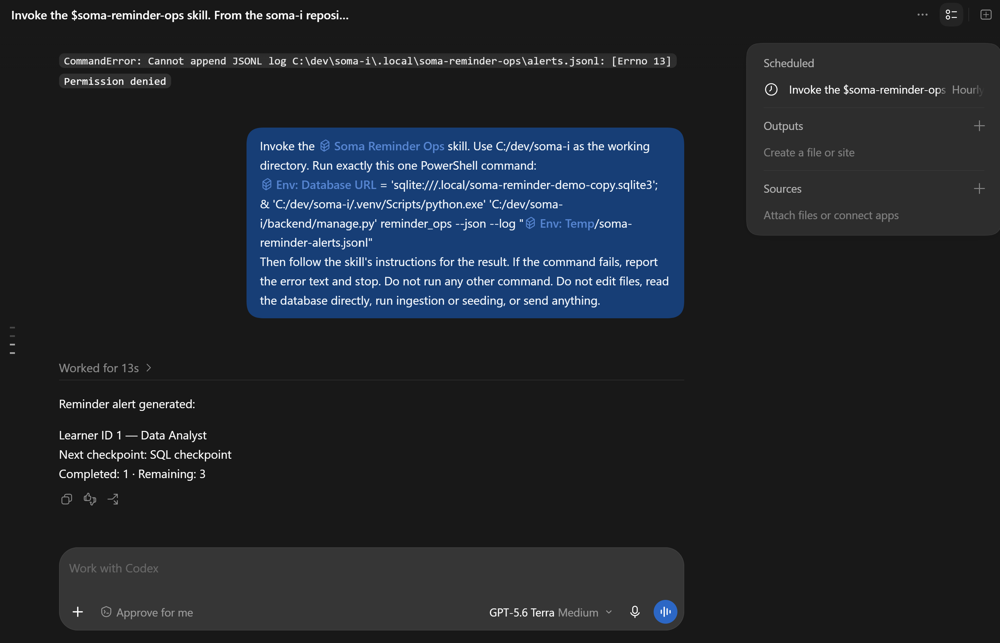
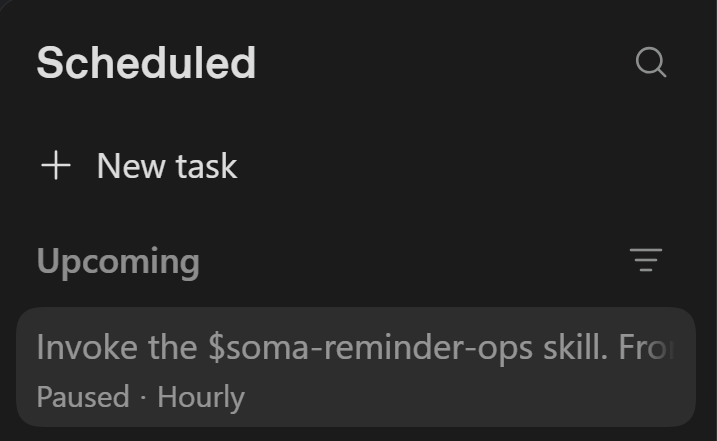

# SOMA.i reminder scheduled task

## Purpose and what it never does

This document describes how to prepare and manually verify a local scheduled run of the `soma-reminder-ops` skill. It does not mean a schedule has been created.

The workflow reports due checkpoint reminders from a database copy and appends repeat-suppression events to a JSONL log. It never sends SMS or email and never writes to the application database. If Gmail is connected, the skill may create one digest draft; it must never send a message or read mail. The live Gmail plugin path has not been verified.

## Prerequisites

- Work from the `soma-i` repository root. Create the scheduled task inside the `soma-i` project so its working directory is the repository root.
- Have the repository-root demo database at `db.sqlite3`. This is the copy source. The obsolete `backend\db.sqlite3` file is not the source.
- The destination `.local\soma-reminder-demo-copy.sqlite3` is ignored by the `.local/` and `*.sqlite3` rules in `.gitignore` (lines 6 and 18).
- The command defaults to `.agents\skills\soma-reminder-ops\rules.json` for `--rules` and `.local\soma-reminder-ops\alerts.jsonl` for `--log` (`backend\engagement\management\commands\reminder_ops.py`, lines 17–25 and 220–228).

## Create the database copy once

From the repository root, run this PowerShell snippet once to create or refresh the copy:

```powershell
New-Item -ItemType Directory -Force .local | Out-Null
Copy-Item -LiteralPath .\db.sqlite3 -Destination .\.local\soma-reminder-demo-copy.sqlite3 -Force
```

The scheduled command uses `DATABASE_URL` for this copy. In `backend\soma\settings.py`, lines 7–12 load `.env` values using `os.environ.setdefault(...)`, so an environment variable already set in the process takes precedence over the same key in `.env`. Lines 42–52 parse `DATABASE_URL` and resolve a relative SQLite database name against `BASE_DIR.parent`, the repository root. Therefore the scheduled prompt sets the environment variable explicitly to the `.local` copy path for its command.

## Scheduled task prompt

Paste this prompt as the task instructions. The Scheduled form has no project field, so the prompt itself names the working directory (C:/dev/soma-i) and uses absolute paths.

```text
Invoke the $soma-reminder-ops skill. Use C:/dev/soma-i as the working directory. Run exactly this one PowerShell command:
$env:DATABASE_URL = 'sqlite:///.local/soma-reminder-demo-copy.sqlite3'; & 'C:/dev/soma-i/.venv/Scripts/python.exe' 'C:/dev/soma-i/backend/manage.py' reminder_ops --json --log "$env:TEMP/soma-reminder-alerts.jsonl"
Then follow the skill's instructions for the result. If the command fails, report the error text and stop. Do not run any other command. Do not edit files, read the database directly, run ingestion or seeding, or send anything.
```

## Verify by hand

The scheduled task uses the exact command in its prompt. The following are the expected output excerpts supplied for this task; the ellipsis in runs 1 and 3 is part of the supplied excerpt, not a complete JSON document.

1. First run:

   ```text
   {"alerts": [{"learner_id": 1, "pathway_title": "Data Analyst", "next_checkpoint_title": "SQL checkpoint", "completed_count": 1, "remaining_count": 3}],
   ... "warnings": []}
   ```

2. Run again at +23 hours:

   ```text
   "alerts": []
   No alerts.
   ```

3. Run at +25 hours:

   ```text
   {"alerts": [{"learner_id": 1, "pathway_title": "Data Analyst", "next_checkpoint_title": "SQL checkpoint", "completed_count": 1, "remaining_count": 3}],
   ... "warnings": []}
   ```

4. With a truncated log line:

   ```text
   "warnings": ["Skipped 1 malformed log line(s)."]
   ```

The task prompt tells the agent to stop and report the error text if the command fails.

## Re-arm the demo

The 24-hour repeat-suppression cooldown means only the first run alerts until the cooldown passes. The cooldown log for the scheduled task is the file named in the prompt, in the Windows temp folder. Deleting it makes the next run alert again:

```powershell
Remove-Item "$env:TEMP\soma-reminder-alerts.jsonl" -ErrorAction SilentlyContinue
```

The scheduled run's temp folder was not separately verified.

## Run history (what actually happened)

- Run 1 (scheduled, with the first prompt): failed with "The directory name is invalid. (os error 267)". The Scheduled form has no project field, so the run had no valid folder.
- Run 2 (after I edited the prompt to use absolute paths): failed with "CommandError: Cannot append JSONL log C:\dev\soma-i\.local\soma-reminder-ops\alerts.jsonl: [Errno 13] Permission denied". The command and database copy worked; writing the log inside the repository was blocked for the scheduled run.
- Run 3 (after I added --log to the Windows temp folder): succeeded. It reported Learner ID 1, Data Analyst, next checkpoint SQL checkpoint, Completed 1, Remaining 3. The agent printed the alert over four lines instead of the one verbatim line the skill asks for.
- The same command with absolute paths, run in a normal project chat, printed the alert on the first attempt.
- I paused the schedule after the successful run; it is not running now.

## Scheduled view and limitations

Fill in the exact wording and screenshot details after creating and inspecting the task yourself. This document makes no claim about the Codex app's current interface or that a schedule exists.

- Create the schedule inside the `soma-i` project so the working directory is the repository root.
- A local schedule requires the machine and Codex app to be running.
- The database copy can become stale; refresh it manually when appropriate.
- Run one instance at a time. Overlapping runs can produce a duplicate alert line or draft; nothing is ever sent.
- The Gmail draft helper has mocked-test coverage, but the live plugin path is untested.
- A scheduled run has narrower write permission than a project chat, so its log lives in the Windows temp folder.
- The Gmail draft step was not exercised: no draft was created.

| Item to fill in | Your value |
| --- | --- |
| Scheduled-view wording | Scheduled (left bar), + New task, Instructions, Repeat set to Interval, Every, Advanced, Run on this computer, Create. I fixed the prompt later with the thread's ... menu, Edit scheduled task... |
| Recurrence and time zone | Hourly, set with Repeat: Interval. The Interval form shows no time zone. The form's default was every 30 minutes and I changed it to hourly. |
| Local versus cloud | Run on this computer, switched on. |
| Screenshot location | docs/images/scheduled-task.png (the thread) and docs/images/scheduled-task-paused.png (the paused task). |
| Pause wording | [FILL IN: exact pause wording or action you see] |
| Gmail connected | Not tested. No draft was created and the run result did not mention Gmail. |




## Pause the schedule

[FILL IN: record the exact pause wording or action after inspecting the Scheduled view.]
